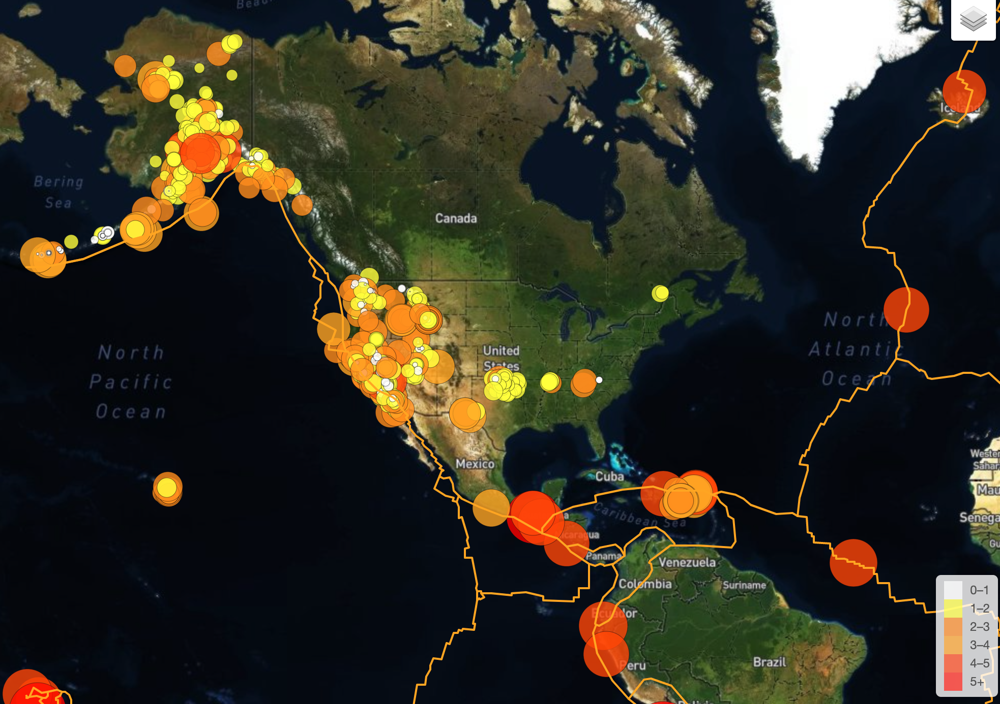
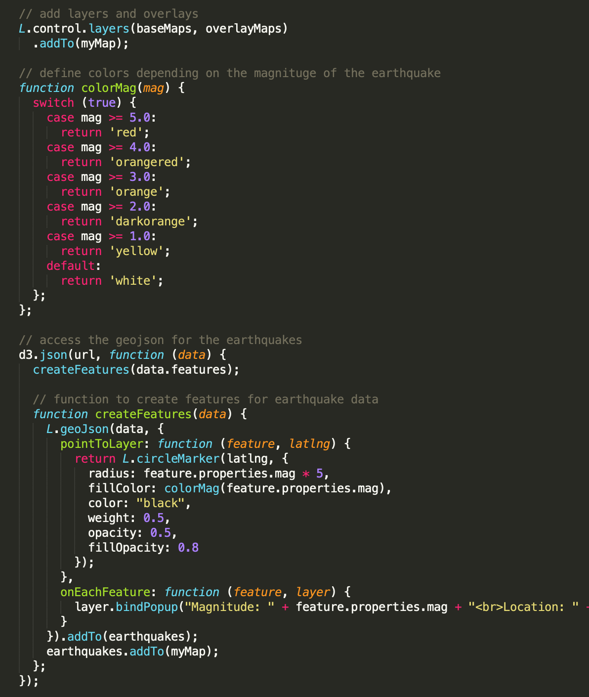

# Leaflet - Basic Skills Demonstration

## Summary: 
This challenge's task was to build a new set of tools to allow visualization of earthquake data. The data set is a collection of a massive amount of data from all over the world each day, but it lack a meaningful way of displaying it. The task was to be able to visualize the data allowingto better educate the public and other government organizations.

https://earthquake.usgs.gov/earthquakes/feed/v1.0/geojson.php

## Final Product: 
 https://kasiakalemba.github.io/Leaflet-World-Earthquakes/

## Skills Displayed: 
* Understanding the basics of creating maps and plotting data with the Leaflet.js library
* Understanding the concept of layers and layer controls and how we can use them to add interactivity to our maps
* Gaining a firm grasp of mapping with GeoJSON

## To run the Code: 
* Download the repository files 
* Open your folder in terminal
* Run the command “python -m http.server”.
* Run the listed server http://0.0.0.0:8000/ in a browser
* Pick and choose which type of map and layers you prefer to see the earthquake data in

## Visualizations:
The USGS provides earthquake data in a number of different formats, updated every 5 minutes. I used the URL of this JSON to pull in the data for our visualization.

* Created a map using Leaflet that plots all of the earthquakes from your data set based on their longitude and latitude
* Illustrated the relationship between tectonic plates and seismic activity. Data on tectonic plates can be found at https://github.com/fraxen/tectonicplates

